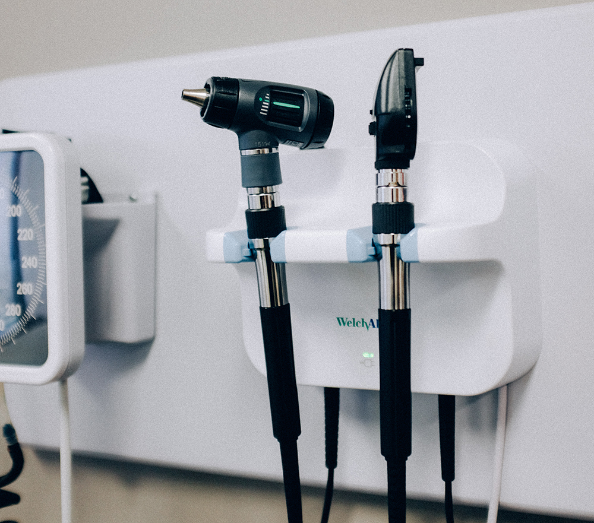

<!-- We believe that patient's safety is one of the main priorities in healthcare.  . -->

<!-- Main -->
<!-- 
 -->

<!-- One -->
<section id="one">
	

		<header class="major">
			<h2>Quick solution</h2>
		</header>
		
KliniCard comes with compact medical information covering essential topics that all practitioners encounter. Handy for doctors, med students, nurses & paramedics. We know how important it is to be prompt with decision making in medicine and KliniCard is designed with exactly that in mind. 

	

</section>

<!-- Two -->
<section id="two" class="spotlights">
	<section>
		
		

			

				<header class="major">
					<h3>Double check anytime</h3>
				</header>
				
Whether it's making a diagnostic or treatment decision, double checking everything to ensure that nothing is out of place is a way to keep the patients safe.

				<ul class="actions">
					<li><a href="elements.html" class="button">Learn more</a></li>
				</ul>
			

		

	</section>
	<section>
		
		

			

				<header class="major">
					<h3>Treat confidently</h3>
				</header>
				
Nullam et orci eu lorem consequat tincidunt vivamus et sagittis magna sed nunc rhoncus condimentum sem. In efficitur ligula tate urna. Maecenas massa sed magna lacinia magna pellentesque lorem ipsum dolor. Nullam et orci eu lorem consequat tincidunt. Vivamus et sagittis tempus.

				<ul class="actions">
					<li><a href="elements.html" class="button">Learn more</a></li>
				</ul>
			

		

	</section>
<!-- 
 -->
